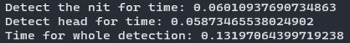
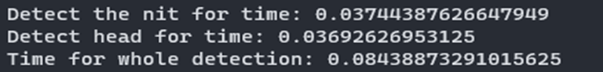
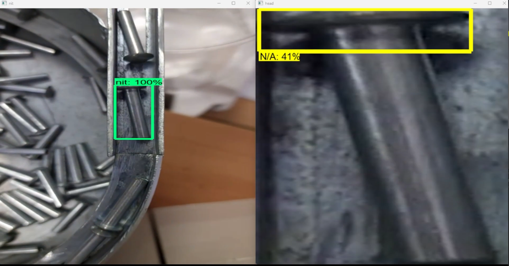

# Automated part orientation recognition system (APORS)

This is the Thesis for my graduation in the Technical University of Sofia with subject: Automated part orientation recognition system (APORS)

> [!WARNING]  
> Because of the models' size, actual model exports are not uploaded. In this repo you can take a look at the implementation of usage of the models and the algorithm and also the actual configuration file for each of the models.

### Overview:

The automated part orientation recognition system is a sophisticated solution designed to determine the orientation of small, elongated objects with large heads, such as a 'nit.' The system employs a two-step approach involving two distinct Tensorflow models to accurately recognize and categorize the orientation of these objects. This technology has diverse applications in quality control, manufacturing, and various industries where precise object orientation matters.

### Key Components:

1. **Object Detection Model (First Stage)**:

    - The first stage of the system employs an object detection model that operates on the entire image to identify the presence of the target object, in this case, the 'nit.' The model can successfully locate the object, regardless of its orientation.
    - Once the object is detected, the system extracts a cropped image of the found object for further analysis.

2. **Head Detection Model (Second Stage)**:

    - The second stage utilizes a separate Tensorflow model to identify the orientation of the 'nit.' This model specifically focuses on detecting the 'head' of the object.
    - By working with a cropped image, the model can pinpoint the 'head' with precision, even if the overall object orientation is uncertain.

3. **Orientation Determination Algorithm**:

    - After detecting the 'head,' an orientation determination algorithm comes into play. This algorithm analyzes the relative position of the 'head' within the cropped image.
    - Based on the position of the 'head,' the algorithm categorizes the orientation as either 'upward' or 'backward.' The two possible orientations reflect the primary ways these objects can be positioned.

### Use Cases:

1. **Quality Control**: This system can be employed in manufacturing and quality control processes to ensure that objects, like 'nits,' are correctly oriented, reducing defects and improving product quality.

2. **Assembly Line Automation**: In assembly line environments, this technology can automate the sorting or assembly of objects based on their orientation.

3. **Inventory Management**: The system can be used for inventory tracking, making it easier to manage items with specific orientations.

4. **Research and Analysis**: Researchers can benefit from this technology in various studies where object orientation is a critical parameter.

### Advantages:

-   **Precision**: The system provides a high degree of precision in determining the orientation of 'nits.'
-   **Automation**: It reduces the need for manual inspection and handling of objects.
-   **Versatility**: The approach can be adapted for other objects with similar characteristics.

The automated part orientation recognition system demonstrates the power of deep learning and computer vision in tackling practical challenges. It showcases how technology can be applied to automate complex tasks in various industries, leading to increased efficiency and accuracy in operations.

# Steps

## 1. Colecting anotating the data

For traiting are used 2500 pictures of the object and 4000 for the head of the object. For this pourpes is maken a vide and the pictures are extracted from it. The video minimum hardware requirements are:

-   60fps
-   HD resolution

          In particular case is used camera with 120 fps and FHD resolution

The anotation is maken via the open source product - [LabelImg](https://github.com/HumanSignal/labelImg)

## 2. Training the modles

3 pairs different model combination were selected to be train and tested. The training data the same for each combination.

-   Test 1 is maken with 2 same SSD ResNet50 V1 640x640 models. The training time is 6h and 12h.
-   Test 2 is maken with 2 same CenterNet ResNet50 V2 512x512. The training time is 33h and 35h.
-   Test 3 is maken with 1 SSD ResNet50 v1 640x640 and 1 SSD MobNet V2 320x320. The training time is 10h and 13h.

## 3. Combine the models and the orientation algorithm.

The orientation algorithm takes bounding box of the detection from the secound model. Normalize the coordinates and check in which part of the picture are located. Depending of the location makes decision what is the actual object orientation.

## 4. Tests

**Test 1**:  

**Test 2**:  

**Test 3**:  

From the perspective of the speed, the second and the third one are faster and can handle up ot 12-15 frames per secound. But in the test is clearly seed they make a lots of wrong decisions and can't be used in a real environment. On the other hand Test 1 can handle up to 8-10fps but the right guesses are above 97%.

That is the results from both models in action:

## Conclusion

In conclusion, Test 1 is fast and accurate enough to be used in a real environment.
